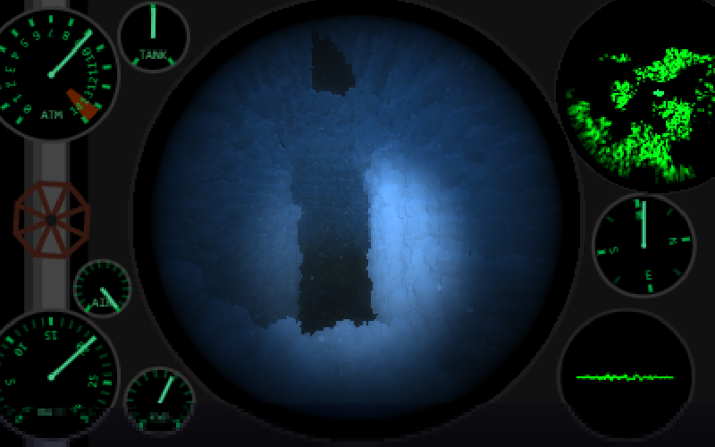

# WWII Pacific Black Cats
A 13Kb javascript game for the JS13K compo of 2025

minify using: npm -g install minify

Test it here: [DEMO](https://tamats.com/games/js13k2025/compo)

## Intro

During the WWII there was an allied squad of fighter planes operating in the Pacific known as the Black Cats. Their PBY Catalinas were painted in black so they couldnt be seen at night. They could land on the sea, had a radar, and had a long range. They are considered the first stealth fighter planes.

Their missions were from rescuing downed pilots in the sea to sink enemy vessels using their torpedos.

This game trys to pay tribute to these pilots.

##KEYS

W/S Pitch
Q/E Yaw
A/D Roll
R/T Engine throttle
T Fast forward time
Z Throw Torpedo
C Shoot guns
1..9 Change views
M Map
N Radar
Right Moust Button = Binoculars

##Tutorial

There are three missions to accomplish:
- Rescue downed pilots (they float on a raft, they are hard to find)
- Sink Japanese transports (careful, they are equipped with AA Guns)
- Sink Japanese submarines

If you run out of fuel or ammo, fly back to the base and land near it, it will refill them automatically.

##Tips

Use the scope view (Key 7) to aim better your torpedos.
Careful with the fuel, if you run out you are lost.
To sink vessels, try to fly close to the sea, that way they cant shoot you, or wait until is dark.
Remember to check the map and the radar.

##Comments

I runned out of space too soon while making the game which meant I spent more time reducing the size than adding all the features I had in mind.

